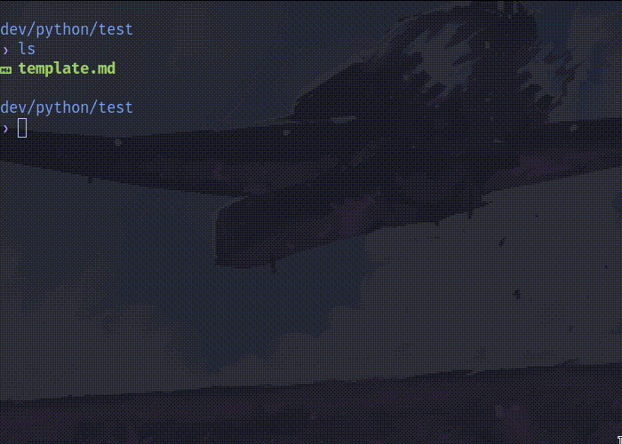

<div align="center">

# 📓yournal.py
Fast (y)ournal script to make Daily Notes on your terminal.


[](https://github.com/psf/black)



</div>

## Usage

This is a Python script, so you need to have Python installed on your system (duh).

So, if you are on Linux or MacOS, running the script is as easy as:

```shell
./yournal.py
```

For Windows:

```shell
python yournal.py
``` 

The daily note will be opened with your `EDITOR` variable. If this fails, the default text editor of your system will be used.

> See `--help` for more information or [configuration](#configuration) to configure it.

## Install

First clone this repository:

```shell
git clone https://github.com/Rikiub/yournal.py.git
```

And add the `yournal.py` file to your system **PATH**. For example, a common Linux user **PATH** is: *~/.local/bin*

> Rename `yournal.py` to `yournal` if you want a short command.

### Optional dependences

For [templating support](#templating) you need install the [arrow](https://github.com/arrow-py/arrow) package. You can install it with pip:

```shell
pip install arrow
```

## Templates

Yeah, that's support templates! Both static and dynamic. To use templates you must specify a file with the `-t` flag:

```
yournal.py -t path/to/template.md
```

You need install [this](#optional-dependences) to enable dynamic templates support.

> For now, dynamic templates follow the [Obsidian Templates](https://help.obsidian.md/Plugins/Templates#Template+variables) syntax.

### Explaining dynamic templates

What is a *dynamic template*? A template with replaceable variables. For example, we have this `template.md` file:

```md
# {{date}}

My friend Mike is going to the beach on {{date:YYYY}} at {{time}} in the afternoon...
```

When we run the script using `template.md` as template, everything surrounded by `{{}}` will be replaced by the following:

```
# 2023-09-20

My friend Mike is going to the beach in 2023 at 15:47 in the afternoon....
```

## Configuration

By default, `yournal.py` will create the daily notes in the current working directory. To change this behavior, you need to set these environment variables on your system:

- `YOURNAL_DIR` for the directory where the Daily Notes will be saved.
- `YOURNAL_TEMPLATE` for the [template](#templating) file to use.
